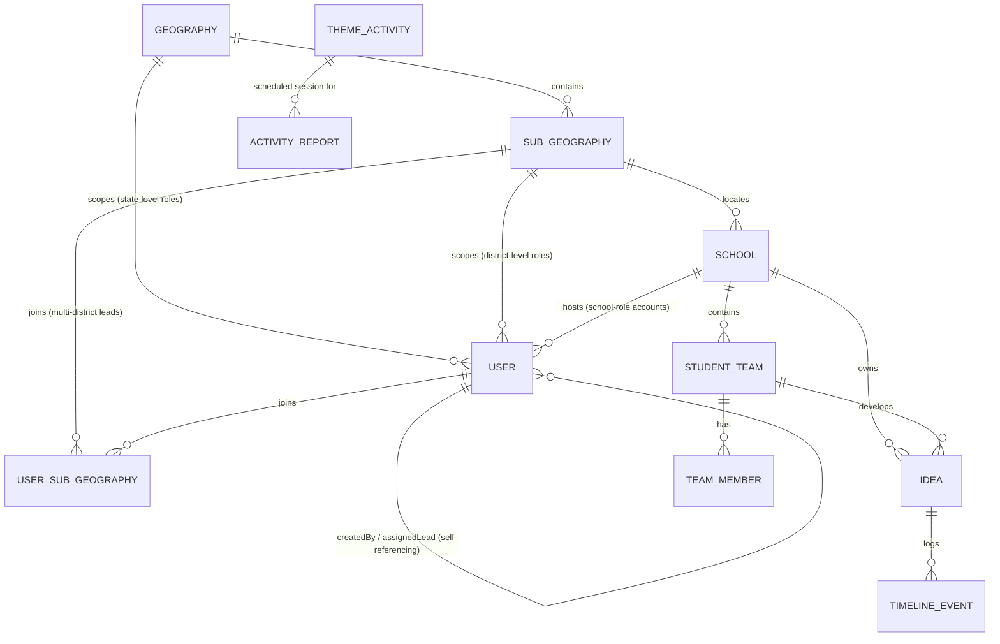

# Database Structure — Pi Jam Idea Bank

PostgreSQL via Prisma ORM (`prisma/schema.prisma`). 12 models across four concerns: geographic hierarchy, identity, the idea/design-thinking pipeline, and activity/audit logging.

---

## Entity Relationship Diagram

`AuditLog` and `Theme` stand alone — no foreign keys in either direction. `ThemeActivity` → `ActivityReport` is a logical link only (matched by `activityId` as a plain string, not a Prisma relation — see caveats).

---

## Models

### Geography
State-level territorial unit. Root of the scoping hierarchy.

| Field | Type | Notes |
|---|---|---|
| `id` | `String` (cuid) | PK |
| `name` | `String` | Unique. e.g. "Maharashtra" |
| `code` | `String` | Unique. Short state code |
| `createdAt` | `DateTime` | |

Relations: `subGeographies[]`, `users[]` (geography-lead / sed-department accounts scoped directly to a state).

---

### SubGeography
District-level unit, nested under a `Geography`.

| Field | Type | Notes |
|---|---|---|
| `id` | `String` (cuid) | PK |
| `name` | `String` | District name |
| `geographyId` | `String` | FK → Geography, `onDelete: Cascade` |
| `createdAt` | `DateTime` | |

Unique: `(name, geographyId)` — same district name can exist in different states.
Relations: `geography`, `schools[]`, `users[]` (teacher-trainer accounts), `assignedLeads[]` (via `UserSubGeography`).

---

### School
A registered school. The tenancy boundary for most of the app's data.

| Field | Type | Notes |
|---|---|---|
| `id` | `String` (cuid) | PK |
| `name` | `String` | **Unique.** Also the join key `StudentTeam`/`Idea`/`ActivityReport` use for their denormalized `schoolName` snapshot |
| `location` | `String` | Free-text display location |
| `subGeographyId` | `String?` | FK → SubGeography. **Nullable** — a school without one is invisible to geography-lead/SED scoping |
| `address`, `phone`, `website`, `principalName` | `String` | Contact/profile fields |
| `udaiseCode` | `String` | **Unique.** India's official school registration code |
| `createdAt` | `DateTime` | |
| `createdBy` | `String?` | Free-text, not a FK |

Relations: `subGeography`, `schoolUsers[]` (User), `teams[]` (StudentTeam), `ideas[]` (Idea).

---

### User
Every non-student account (super-admin, program-lead, geography-lead, teacher-trainer, school, sed-department). Students authenticate through `StudentTeam` instead, not this table.

| Field | Type | Notes |
|---|---|---|
| `id` | `Int` (autoincrement) | PK |
| `role` | `String` | One of the 7 `Role` values — not a DB enum, just a string |
| `schoolName` | `String?` | Denormalized display copy for `role: school` accounts |
| `schoolId` | `String?` | FK → School, `onDelete: SetNull` |
| `displayName` | `String` | |
| `email` | `String` | **Unique, `@db.Citext`** — case-insensitive at the database level |
| `passwordHash` | `String?` | `scrypt` salt:hash. **Null for auto-provisioned accounts** (e.g. SED observers) that were never given a password |
| `teamId` | `String?` | Free-text, unused FK-shaped field (not a real relation) |
| `geographyId` | `String?` | FK → Geography (state-scoped roles) |
| `subGeographyId` | `String?` | FK → SubGeography (legacy single-district case) |
| `assignedLeadUserId` | `Int?` | Self-FK → User, `onDelete: SetNull`. Links a Teacher Trainer to their Geography Lead |
| `createdById` | `Int?` | Self-FK → User, `onDelete: SetNull`. Audit trail of who minted this account |
| `createdAt` | `DateTime` | |

Relations: `geography`, `subGeography`, `school`, `assignedSubGeos[]` (via `UserSubGeography` — multi-district assignment), `createdBy`/`createdUsers[]`, `assignedLead`/`assignedTrainers[]`.

Indexes: `geographyId`, `subGeographyId`, `schoolId`, `role`, `assignedLeadUserId`.

---

### UserSubGeography
Many-to-many join: one Geography Lead can be assigned several districts within their state. Coexists with `User.subGeographyId` for the legacy single-district case — new geography-lead assignments use this join exclusively.

| Field | Type | Notes |
|---|---|---|
| `userId` | `Int` | FK → User, `onDelete: Cascade` |
| `subGeographyId` | `String` | FK → SubGeography, `onDelete: Cascade` |
| `createdAt` | `DateTime` | |

PK: composite `(userId, subGeographyId)`.

---

### StudentTeam
A team of students at a school. Also the **login credential** for the `student` role (Team ID + PIN, no email).

| Field | Type | Notes |
|---|---|---|
| `id` | `String` (cuid) | PK — this is the "Team ID" students type in at login |
| `pin` | `String` | `scrypt` salt:hash, **or** a plaintext value for seed/demo rows (auth checks for a `:` separator to tell which) |
| `name` | `String` | e.g. "Green Sparks" |
| `schoolName` | `String` | Denormalized snapshot of `School.name` — see caveats |
| `schoolId` | `String` | Authoritative FK → School, `onDelete: Cascade` |
| `type` | `String` | `"student"` or `"teacher"` — default `"student"`. Teacher-run teams bypass the advance-approval gate |
| `createdAt` | `DateTime` | |

Unique: `(schoolName, pin)` — PIN only needs to be unique per school, not globally.
Relations: `members[]` (TeamMember), `ideas[]` (Idea), `school`.

---

### TeamMember
An individual student inside a `StudentTeam`.

| Field | Type | Notes |
|---|---|---|
| `id` | `String` (cuid) | PK |
| `studentTeamId` | `String` | FK → StudentTeam, `onDelete: Cascade` |
| `name`, `grade`, `contactNumber` | `String` | |
| `gender` | `String` | Free-text, not a DB enum (app-level type is `"Male" \| "Female" \| "Non-binary" \| "Prefer not to say"`) |

---

### Idea
The core entity: a project moving through the five Design Thinking stages.

| Field | Type | Notes |
|---|---|---|
| `id` | `String` (cuid) | PK |
| `schoolName` | `String` | Denormalized snapshot of `School.name` |
| `schoolId` | `String` | Authoritative FK → School, `onDelete: Cascade` |
| `title`, `theme` | `String` | |
| `teamId` | `String?` | FK → StudentTeam, `onDelete: SetNull`. Nullable so deleting a team doesn't delete its ideas |
| `studentTeam` | `String` | Denormalized team-name snapshot, used for display when `teamId` is null |
| `problemStatement`, `targetAudience` | `String` | |
| `status` | `String` | One of `Empathize \| Define \| Ideate \| Prototype \| Test` — not a DB enum |
| `stageData` | `Json?` | Per-stage form data, keyed by stage name: `{ Empathize: {...}, Define: {...}, ... }` |
| `lastUpdated` | `DateTime` | `@updatedAt` — auto-bumped on every write |
| `createdAt` | `DateTime` | |

Relations: `school`, `team`, `timeline[]` (TimelineEvent).
Indexes: `schoolName`, `schoolId`, `teamId`.

**Row-level scoping** (enforced in `lib/db/scoping.ts`, not the database): every list query is filtered by role — global for super-admin/program-lead, by `Geography`/`SubGeography` join for geography-lead/teacher-trainer/sed-department (plus a `status IN (Prototype, Test)` filter for sed-department), by `schoolName` for school, by `teamId` for student.

---

### TimelineEvent
Append-only audit trail of everything that happens to one `Idea` — creation, stage changes, comments, and the advance-request gate (`advance_requested` → `advance_approved` / `advance_rejected` → `stage_change`).

| Field | Type | Notes |
|---|---|---|
| `id` | `String` (cuid) | PK |
| `ideaId` | `String` | FK → Idea, `onDelete: Cascade` |
| `type` | `String` | `created \| stage_change \| form_submitted \| comment \| test_failed \| advance_requested \| advance_approved \| advance_rejected` |
| `stage`, `fromStage`, `toStage` | `String?` | Stage name(s) involved, where applicable |
| `content` | `String?` | Free text — comment body, rejection reason, etc. |
| `author` | `String?` | Display name, not a FK |
| `timestamp` | `DateTime` | |

Indexes: `ideaId`, `timestamp`.

---

### Theme
Super-admin-curated monthly theme (e.g. "February: Sustainability"). No foreign keys — `Idea.theme` and `ThemeActivity.theme` reference it by matching string, not by FK.

| Field | Type | Notes |
|---|---|---|
| `id` | `String` (cuid) | PK |
| `month` | `String` | **Unique.** e.g. "February" |
| `shortMonth`, `theme`, `description`, `icon`, `gradient` | `String?`/`String` | Display fields |
| `sortOrder` | `Int` | Default 0, for calendar ordering |
| `createdAt`, `updatedAt` | `DateTime` | |

---

### ThemeActivity
A scheduled classroom session on the theme calendar.

| Field | Type | Notes |
|---|---|---|
| `id` | `String` | PK — app-generated (`act-<timestamp>`), not `@default(cuid())` |
| `scheduledDate` | `DateTime` | Authoritative date (UTC midnight) |
| `title`, `theme` | `String` | |
| `schoolName` | `String?` | **Null = global/all-schools activity.** Not a FK |
| `description` | `String?` | |
| `createdAt` | `DateTime` | |

Index: `scheduledDate`.

---

### ActivityReport
A teacher's session report against a `ThemeActivity` — attendance, materials, and lab-safety compliance.

| Field | Type | Notes |
|---|---|---|
| `id` | `String` (cuid) | PK |
| `activityId` | `String` | **Matches `ThemeActivity.id` by value only — no `@relation`, no FK constraint** |
| `schoolName` | `String` | Server-bound to the submitting user's school, not client-supplied |
| `teacherName`, `sessionDate`, `timeIn`, `timeOut`, `grades` | `String` | |
| `totalStudents`, `boysCount`, `girlsCount` | `Int` | |
| `lcmsCode` | `String?` | |
| `topicsLessons`, `learningGoal` | `String` | |
| `materials` | `Json` | Array of `{ name, quantityUsed, stockStatus }` |
| `safetyBriefing`, `ppeWorn`, `labCleanup` | `Boolean` | Safety-audit checklist |
| `incidentNotes` | `String?` | |
| `studentEngagement` | `String` | `"Low" \| "Moderate" \| "High"` — not a DB enum |
| `successes`, `challenges`, `followUpActions` | `String` | |
| `submittedBy` | `String` | Display name |
| `createdAt` | `DateTime` | |

Indexes: `schoolName`, `activityId`.

---

### AuditLog
System-wide audit trail for mutating actions (idea create/update/delete, team create/edit, user provisioning, theme changes, onboarding). Written by `lib/audit.ts`, fire-and-forget — a failed audit write never blocks the triggering request.

| Field | Type | Notes |
|---|---|---|
| `id` | `String` (cuid) | PK |
| `actorId`, `actorRole` | `String?` | Snapshot of the acting user — not a FK, survives account deletion |
| `actorEmail` | `String?` | **Currently always written as `null`** — see caveats |
| `action` | `String` | e.g. `"idea.create"`, `"team.delete"`, `"admin.user.create.geography-lead"` |
| `entityType`, `entityId` | `String?` | What was acted on |
| `schoolName` | `String?` | |
| `ip` | `String?` | Resolved via `x-forwarded-for` / `x-real-ip` |
| `payload` | `Json?` | Action-specific detail |
| `createdAt` | `DateTime` | |

Indexes: `(entityType, entityId)`, `actorId`, `createdAt`.

---

## Cross-cutting patterns

**Denormalized `schoolName`.** `User`, `StudentTeam`, `Idea`, and `ActivityReport` all carry a `schoolName` string alongside (or instead of) a proper `schoolId` FK. This is a deliberate display-snapshot pattern (renaming a school doesn't need to cascade), but it means `schoolName` and `schoolId` can drift out of sync if a school is ever renamed — nothing re-syncs the snapshots today.

**No DB-level enums.** `role`, `status` (Idea), `type` (TimelineEvent/StudentTeam), `studentEngagement` — all plain `String` columns. Every valid-value constraint lives in application code (`types/index.ts`, zod schemas in the API routes), not in Postgres. A bad direct `UPDATE` can put a row in a state the app doesn't expect.

**`ActivityReport.activityId` isn't a real relation.** It's a bare string matched against `ThemeActivity.id` by the application, with no foreign key and no `onDelete` behavior — deleting a `ThemeActivity` orphans its reports silently.

**`AuditLog.actorEmail` is dead weight.** The column exists and is queryable, but `lib/audit.ts` always writes `null` to it — every row so far has `actorId`/`actorRole` but no email.

---

## Known infrastructure gap: migration history

`prisma/migrations/` contains 11 migration files, but **they don't reconstruct the schema above** — `Geography`, `SubGeography`, and `StudentTeam.type` are never created by any migration (confirmed via `prisma migrate diff` against a shadow DB, and via `prisma migrate status` against the real one, which reports all 11 as "not applied" even on a database that already has most of these tables). This database was built and is kept in sync via `npx prisma db push`, not `prisma migrate deploy`. `npm run build`'s `prisma generate` step doesn't touch schema state, so this doesn't block builds — but a genuine `prisma migrate deploy` (e.g. in a CI/CD pipeline) would fail partway through. Until the migration history is rebuilt from a clean baseline, **use `prisma db push` for all schema changes**, not `prisma migrate dev`.

---

*Source of truth: `prisma/schema.prisma`. Regenerate this file's field tables from there if the schema changes — don't hand-edit around a drifted schema.*
