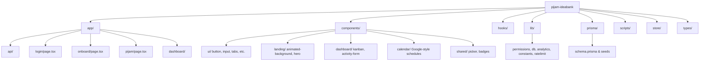
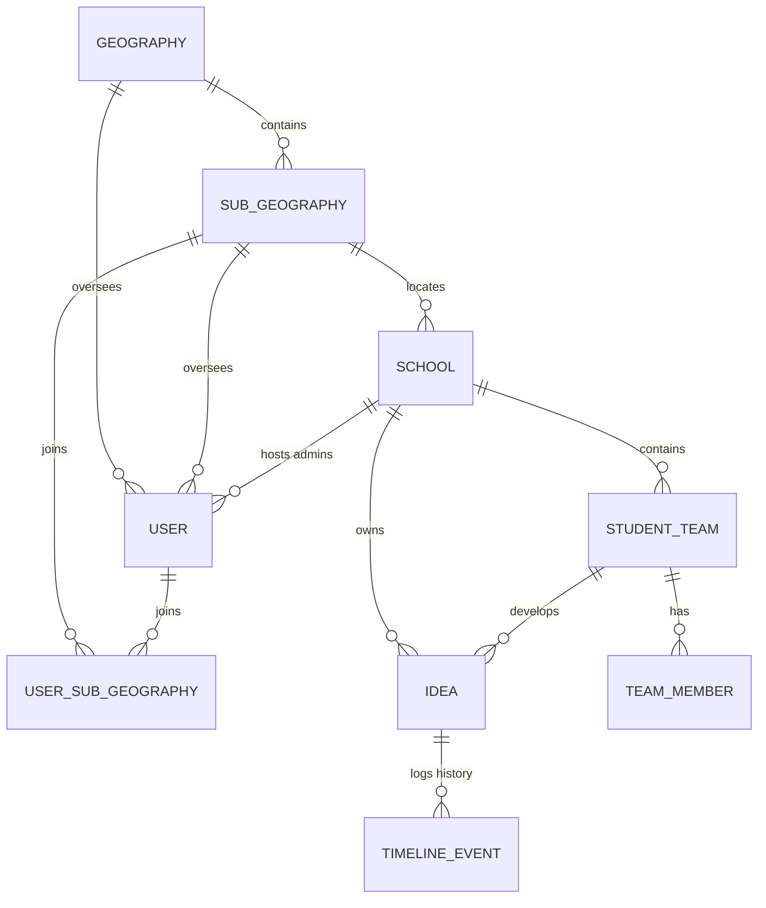

# 💡 Pi Jam Idea Bank — Latest Project Context

This document provides a highly structured and comprehensive overview of the **Pi Jam Idea Bank** project as of **May 2026**. It aggregates system architecture, database design, directory layouts, security structures, visual guidelines, and recent high-fidelity modifications to serve as a reliable reference for all development.

---

## 🎯 1. Project Vision & Core Objectives

The **Pi Jam Idea Bank** is a collaborative web platform designed by the **Pi Jam Foundation** to nurture innovation and Computational Thinking in classrooms across India. By offering structured pathways and administrative features, the platform connects students, teachers, program field staff, and government education departments in a unified workspace.

Key goals include:
1. **Scaffolding Design Thinking**: A step-by-step digital pipeline guiding students through the 5 phases of design innovation (*Empathize*, *Define*, *Ideate*, *Prototype*, *Test*).
2. **Standardized Calendar Alignment**: Thematic monthly focuses (e.g., Sustainability, EdTech, Climate, Health) with custom visual branding.
3. **Data-Driven Governance**: State Education Departments (SED) access read-only regional analytical dashboards to monitor student-led developments and identify high-potential prototype ideas.
4. **Passcode Student Logins**: Student teams can log in using unique auto-generated team IDs and numeric PINs, keeping onboarding easy for low-resource classroom environments.
5. **Classroom Activity & Safety Auditing**: Streamlined educator forms to report classroom sessions, track materials, record student attendance by gender, and audit lab-safety compliance.

---

## 💻 2. Technology Stack & Frameworks

The platform uses a modern, high-performance stack optimized for responsive rendering, security, and developer productivity:

* **Framework**: [Next.js (v16.1.7)](https://nextjs.org/) utilizing the App Router (`app/`) and [React 19](https://react.dev/).
* **Styling**: [Tailwind CSS v4](https://tailwindcss.com/) with a curated, premium visual signature.
* **Component Library**: Custom styling built atop [shadcn/ui](https://ui.shadcn.com/) and Radix UI primitives.
* **Database & ORM**: PostgreSQL database hosted on **Neon**, mapped and queried via [Prisma ORM (v6.11.1)](https://www.prisma.io/).
* **State Management**: [Zustand](https://zustand-demo.pmnd.rs/) with decentralized client stores for quick API caching.
* **Animations**: [Framer Motion](https://www.framer.com/motion/) for premium floating gradients and interactive card transitions.
* **Authentication**: [NextAuth.js (v5.0.0-beta.31)](https://next-auth.js.org/) supporting robust multi-role session parsing.

---

## 📂 3. Directory Structure & File Map



### 🗂️ Principal Subdirectories:
* **`app/`**: Contains page routes, layouts, server-side APIs, and custom routing handlers.
  * `app/page.tsx`: Premium interactive portal landing page.
  * `app/login/`: Glassmorphic, tabbed card login layout supporting both password (staff) and PIN-based (student) logins.
  * `app/onboard/`: School onboarding wizard containing autocomplete geographic state/district options.
  * `app/pijam/`: Registration workflow for field team staff (Geography Leads and Teacher Trainers).
  * `app/dashboard/`: Core application workspace containing statistics, project boards, calendar planning, and activity submissions.
  * `app/api/`: REST endpoints for schools, ideas, teams, activity reports, themes, and background seeding.
* **`components/`**: Modular, highly reusable React components.
  * `components/landing/`: Visual assets like `<AnimatedBackground />` and floating header panels.
  * `components/dashboard/`: Interactive Kanban pipelines, drag-and-drop lists, and activity feedback forms.
  * `components/calendar/`: Google Calendar-style interfaces for scheduling school activities.
  * `components/ui/`: Underlying design tokens (buttons, tabs, inputs, dropdowns) aligned with Tailwind.
* **`lib/`**: Business logic utilities.
  * `lib/permissions.ts`: Core RBAC evaluation and vertical/horizontal data isolation filters.
  * `lib/constants.ts`: Monthly theme assets, mock credentials, and standard stage definitions.
  * `lib/ratelimit.ts`: Requests auditing and custom secure IP resolution helpers.
  * `lib/indian-states-districts.ts`: Exhaustive geographic dictionary.
* **`store/`**: Lightweight Zustand client-side stores (e.g., `useAuthStore`, `useIdeaStore`, `useThemeStore`, `useActivityStore`).
* **`prisma/`**: Database migrations, base PostgreSQL schemas, and full typescript-seeding scripts (`seed.ts`).

---

## 🗄️ 4. Database Schema & Data Model

The data layer is structured to enforce strong referential integrity, vertical data rollups, and horizontal peer isolation:



### 📊 Model Reference Checklist:
1. **`Geography`**: Represents states (e.g., Maharashtra, Karnataka) containing unique name/code values.
2. **`SubGeography`**: Scoped districts (e.g., Pune, Bangalore) belonging to a specific state.
3. **`School`**: A registered school linked to a district, containing UDAISE code, principal name, website, and location.
4. **`User`**: Core profile storing account roles, credentials, and geographic coordinates. Holds a self-referencing relationship `assignedLeadUserId` to link Teacher Trainers (TT) to their Project/Geography Leads (GL).
5. **`UserSubGeography`**: Many-to-many join model allowing Geography Leads to be assigned to several specific districts within their state.
6. **`StudentTeam`**: A team hosted by a school, authenticated using a unique `schoolName` + numeric `pin` login key.
7. **`TeamMember`**: Represents individual students inside a team, detailing names, grades, and genders.
8. **`Idea`**: Core project traversing the Design Thinking pipeline, tracking status and custom stages (`stageData` stored in JSON format).
9. **`TimelineEvent`**: System event logs capturing creation, stage change transitions, and approvals.
10. **`Theme`**: Monthly calendar configuration detailing representative icons, descriptions, and custom background gradients.
11. **`ThemeActivity`**: Scheduled tasks assigned under a monthly theme.
12. **`ActivityReport`**: Educator session reports detailing boy/girl attendance, learning goals, used materials (JSON), and strict lab-safety checkmarks (PPE, cleanup, safety briefing).

---

## 🛡️ 5. Role-Based Access Control (RBAC) & Data Isolation

Data visibility is strictly filtered in `lib/permissions.ts` to implement a secure, multi-tenant vertical roll-up system:

### 👥 Hierarchical Scoping Matrix

| Role | Access Level | Operations | Data Bounds |
| :--- | :--- | :--- | :--- |
| **Super Admin** | Global | Full platform oversight, manages accounts, seeds databases, schedules themes. | Can view and edit all data across the platform. |
| **Program Lead / TTL** | Global | Configures geographical structures, states, and districts. | Analytical overview across all states. | 
| **Geography Lead (GL)** | State-Scoped | Manages operations and supervises Teacher Trainers within their state. | Isolated strictly to their designated `geographyId`. |
| **State Education Dept (SED)** | State-Scoped (Read-Only) | Observes aggregate progress; views innovative advanced-stage projects. | Only sees `Prototype` & `Test` ideas in their state. |
| **Teacher Trainer (TT)** | District-Scoped | Tracks and supports schools in their assigned districts. | Scoped to districts in `subGeographyId` / `UserSubGeography`. |
| **School Admin (Teacher)** | School-Isolated | Full CRUD on ideas, generates student teams, submits activity reports. | Isolated strictly to their own school's data. |
| **Student Team** | Project-Isolated | Updates details for their assigned idea; submits stage transition requests. | Read-write bounds on their specific `teamId` project only. |

### 🔄 Design Thinking Validation Gates
* **Schools & Super Admins**: Can edit and advance ideas to the next stage immediately.
* **Student Teams**: Can update project details but must submit an **Advance Request** (`advance_requested`) to move stages. School Admins review these requests and can either **Approve** (`advance_approved`, which performs a `stage_change`) or **Reject** (`advance_rejected`) the progression.

---

## 🎨 6. Modern Design System & Custom Tokens

The platform features a highly premium, visually striking user interface designed to inspire students and engage stakeholders:

* **Primary Accent Color**: Modern Teal/Blue HSL dynamic theme token (`--primary: #5BA4C7`, `--ring: #5BA4C7`).
* **Visual Backdrop (`AnimatedBackground`)**: Custom Framer Motion component rendering moving fluid gradient orbs behind a glassy visual layer and custom SVG grid patterns.
* **Acrylic Glassmorphism**: Cards and workspaces use translucent overlays (`backdrop-blur-md bg-card/85 border border-border/40 shadow-2xl`) to provide depth and contrast against the animated background.
* **Steppers & Forms**: Custom 4-step wizard forms containing clean border states, interactive micro-animations (`active:scale-[0.98]`), and rich responsive colors.
* **Interactive Dashboards**: Premium rounded container cards (`rounded-2xl border-border/40 bg-card hover:border-primary/20 transition-all`) housing clean stats and visual kanban columns.

---

## 🚀 7. Key Engineering Advancements & Agent Workflows

A series of critical hotfixes and architectural upgrades have been successfully integrated by prior agents (**Claude** & **Gemini**) during system sweep phases:

> [!TIP]
> **Authentication polymorphic request parsing** and **defensive unauthenticated session hydration guards** prevent common runtime anomalies, ensuring a clean Next.js build.

### 🐛 1. Safe Request Header Parsing (NextAuth 500 Fix)
* **Problem**: In Vercel serverless runs, standard NextAuth request context structures pass plain-record header values instead of standard `Request` objects, causing standard `req.headers.get("x-forwarded-for")` queries to crash with a fatal `TypeError` during login.
* **Resolution**: Updated `ipFromRequest` in `lib/ratelimit.ts` to dynamically handle both fetch-like headers and plain JS object dictionaries safely, falling back to empty/socket IPs if needed.

### 🛡️ 2. Safe Session Hydration (GET /api/auth/session 500 Fix)
* **Problem**: Client-side store hydration queries `/api/auth/session` instantly on landing. If a user is not authenticated, NextAuth returns an empty token shell. Code attempting to write `session.user.id = token.uid` crashed due to writing to properties of an undefined `user`.
* **Resolution**: Implemented strong defensive guards inside the `session` callback within `auth.config.ts` to ensure `session.user` and `token` fields are fully instantiated before mapping variables:
  ```typescript
  async session({ session, token }) {
    if (session.user && token?.uid) {
      session.user.id = token.uid;
      session.user.role = token.role;
      // Scoped authentication elements
    }
    return session;
  }
  ```

### ⚙️ 3. Verification & Compilation Quality Checks
* The project compiles cleanly:
  * `npm run typecheck` resolves with **0 TypeScript errors**.
  * `npm run build` succeeds on Next.js App Router compiler layers with **0 warnings or compile-time breaks**.
  * Neon PostgreSQL migrations are successfully mapped and client codes are fully generated (`npx prisma generate`).

### 👑 4. Program Lead / TTL Provisioning
* **Problem**: Although the `program-lead` (TTL) role was supported by permissions checks (`lib/permissions.ts`), the Super Admin dashboard and account creation API strictly limited creation scope to `super-admin` and `geography-lead`.
* **Resolution**: Updated the validation schema in `app/api/admin/users/route.ts` and the Admin Users Dashboard UI in `app/dashboard/admin/users/page.tsx` to support creating, displaying, and managing `program-lead` accounts directly alongside other admin types.

---

## ⚙️ 8. Local Workspace Commands

```bash
# Install all required npm packages
npm install

# Start local development server with turbopack
npm run dev

# Generate Prisma Client classes
npx prisma generate

# Apply local database schemas
npx prisma db push

# Run full database seeds (States, Districts, Schools, Themes, and Users)
npm run db:seed

# Complete code formatter (TypeScript & TSX files)
npm run format

# Run TS compilations to verify code sanity
npm run typecheck

# Full production build test
npm run build
```

---

*For queries on this document or to append newer modules, refer to original instructions in [README.md](file:///f:/Devlopment%20Projects/pijam-ideabank/README.md) and [RBAC.MD](file:///f:/Devlopment%20Projects/pijam-ideabank/RBAC.MD).*
